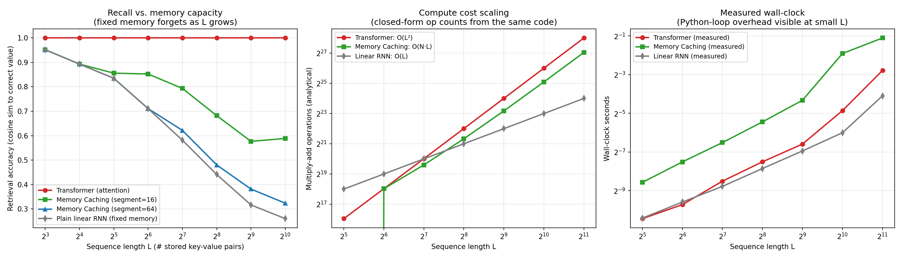
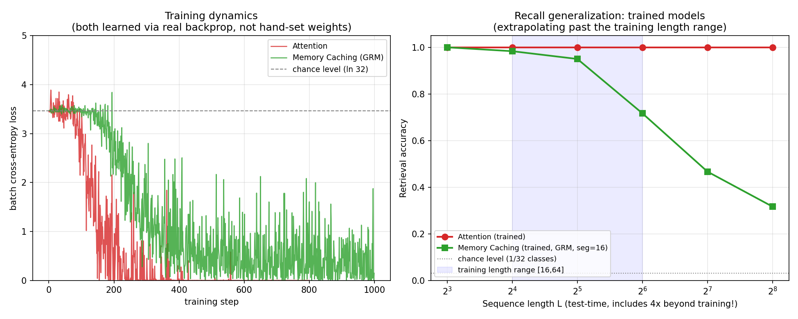

# Memory Caching vs. Transformer Attention

A hands-on comparison of the **Memory Caching (MC)** technique from
[*Memory Caching: RNNs with Growing Memory*](https://arxiv.org/abs/2602.24281)
(Behrouz, Li, Deng, Zhong, Razaviyayn, Mirrokni) against plain causal
self-attention and a plain fixed-size linear-attention RNN.

The paper's core idea: RNNs compress the past into a **fixed-size** memory
state and forget as sequences grow. Transformers never forget (every token
is individually "cached") but pay `O(L²)` for it. Memory Caching checkpoints
segments of the recurrent state, letting effective memory grow with sequence
length at a tunable `O(N·L)` cost — a dial between the two extremes.

This repo has two layers of comparison:

1. **Hand-set weights** (`mechanisms.py`, `experiments/exp1_*`, `exp2_*`) —
   implements the three retrieval mechanisms directly from their equations
   with random projections and a hand-calibrated "sharpness" temperature
   (standing in for what training would learn), to isolate the *pure math*
   of capacity vs. compute.
2. **Actually trained** (`autograd.py`, `models.py`, `experiments/exp3_*`) —
   a small NumPy autograd engine (verified against finite differences, see
   `tests/`), used to train single-layer Attention and MC (GRM) models with
   real backprop on an associative-recall task, then test generalization to
   sequence lengths far beyond training.

No PyTorch dependency — everything is built on NumPy so it runs anywhere.

## Results

### Hand-set weights: recall vs. capacity, and compute cost scaling


Attention never forgets regardless of how many pairs are stored; a plain
fixed-size RNN degrades steadily; Memory Caching sits in between and is
tunable via segment size. Compute cost: Attention is `O(L²)`, plain RNN is
`O(L)`, and *constant-segment* MC is `O(L²/C)` — same order as attention,
smaller constant (only *logarithmic* segmentation gets truly sub-quadratic).

### Trained models: does the recall gap survive real gradient descent?


Both models are trained only on sequence lengths 16–64, then evaluated up to
length 256 (4x beyond training). Attention generalizes to unseen lengths
essentially perfectly. Memory Caching holds up well near its training range
but degrades once truly extrapolating — its fixed per-segment capacity runs
out. MC is also noticeably harder to optimize (noisier loss curve, needs
gradient clipping and ~2x more training steps) — a small, real echo of why
the original paper needed several aggregation variants (gating, Memory Soup,
sparse selection) rather than a single simple fix.

## Repo layout

```
mechanisms.py           # attention / linear-RNN / MC (GRM) — hand-set weights
autograd.py             # from-scratch reverse-mode autograd (NumPy only)
models.py               # trainable single-layer Attention & MC (GRM) models
optim.py                # Adam optimizer + gradient clipping
experiments/
  exp1_accuracy.py       # recall accuracy vs. sequence length (hand-set)
  exp2_complexity.py     # compute cost scaling (hand-set)
  exp3_trained_comparison.py   # train both models, test length generalization
  make_plots.py           # renders results/comparison.png
  make_trained_plots.py   # renders results/trained_comparison.png
tests/
  test_autograd.py        # gradient checks for every autograd op vs. finite differences
results/                  # generated plots + raw .npz result data
```

## Setup

```bash
python3 -m venv venv
source venv/bin/activate
pip install -r requirements.txt
```

## Reproducing the results

```bash
# 1. verify the autograd engine is correct (do this first)
python3 tests/test_autograd.py

# 2. hand-set-weights experiments
python3 experiments/exp1_accuracy.py
python3 experiments/exp2_complexity.py
python3 experiments/make_plots.py

# 3. trained-model comparison (takes ~30-60s on CPU)
python3 experiments/exp3_trained_comparison.py
python3 experiments/make_trained_plots.py
```

All outputs are written to `results/`.

## Caveats / what this is not

- Single layer, single head — not a full multi-layer Transformer or a
  production RNN architecture. This isolates the *retrieval mechanism*,
  which is the part the paper's math is actually about.
- The "hand-set weights" experiments use a manually calibrated softmax
  temperature to represent what training *would* learn; the trained-model
  experiments (`exp3`) remove that crutch and learn everything via gradient
  descent instead.
- Associative-recall (MQAR-style) task only — doesn't cover language
  modeling perplexity or the other benchmarks in the original paper.

## Reference

Behrouz, A., Li, Z., Deng, Y., Zhong, P., Razaviyayn, M., & Mirrokni, V.
*Memory Caching: RNNs with Growing Memory.* arXiv:2602.24281, 2026.
